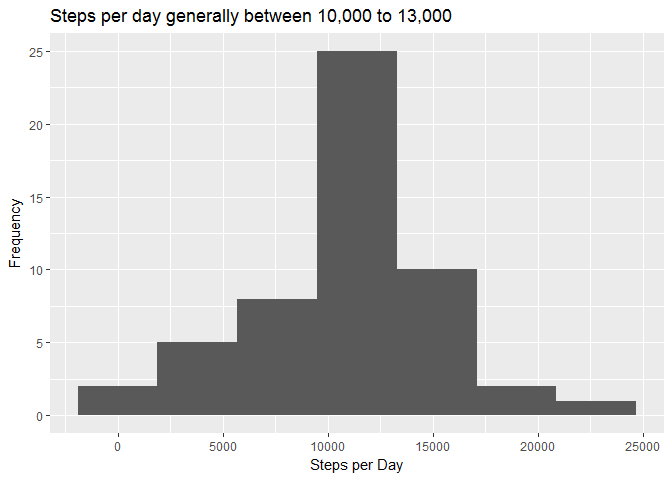

# Reproducible Research: Peer Assessment 1


## Loading and preprocessing the data

```r
library(dplyr, quietly = TRUE)
```

```
## 
## Attaching package: 'dplyr'
```

```
## The following objects are masked from 'package:stats':
## 
##     filter, lag
```

```
## The following objects are masked from 'package:base':
## 
##     intersect, setdiff, setequal, union
```

```r
library(readr, quietly = TRUE)
library(ggplot2, quietly = TRUE)
activity <- read_csv(file = "data/activity.csv", col_names = TRUE)
```

```
## Parsed with column specification:
## cols(
##   steps = col_integer(),
##   date = col_date(format = ""),
##   interval = col_integer()
## )
```

```r
activity
```

```
## # A tibble: 17,568 x 3
##    steps       date interval
##    <int>     <date>    <int>
##  1    NA 2012-10-01        0
##  2    NA 2012-10-01        5
##  3    NA 2012-10-01       10
##  4    NA 2012-10-01       15
##  5    NA 2012-10-01       20
##  6    NA 2012-10-01       25
##  7    NA 2012-10-01       30
##  8    NA 2012-10-01       35
##  9    NA 2012-10-01       40
## 10    NA 2012-10-01       45
## # ... with 17,558 more rows
```


## What is mean total number of steps taken per day?

```r
# First summarise data by day
activity_by_day <- activity %>% 
group_by(date) %>% 
summarise(steps = sum(steps))

# Plot histogram
activity_by_day %>% 
ggplot(aes(steps)) + 
  geom_histogram(binwidth = 3800) +
  labs(x = "Steps per Day", y = "Frequency", title = "Steps per day generally between 10,000 to 13,000")
```

```
## Warning: Removed 8 rows containing non-finite values (stat_bin).
```

<!-- -->


## What is the average daily activity pattern?


## Imputing missing values


## Are there differences in activity patterns between weekdays and weekends?
